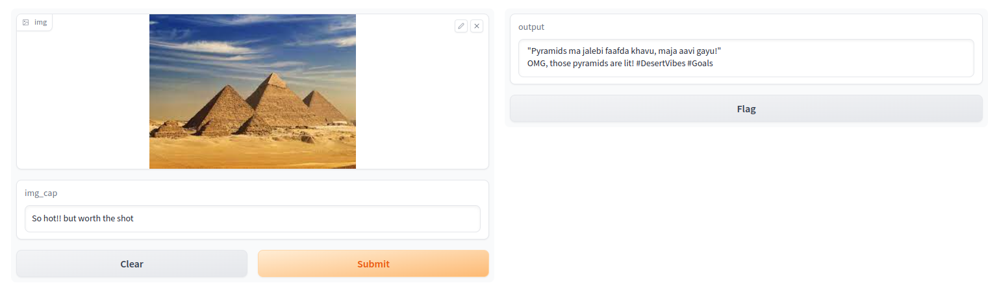
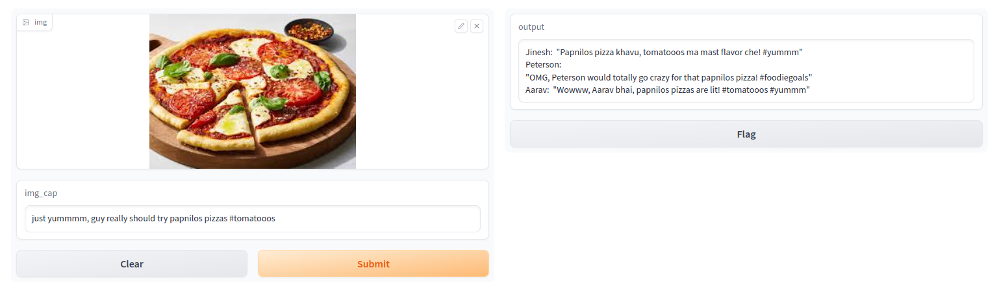

# SOCIAL MEDIA COMMENT_BOT
## Mini Playbook Project 01
This is an test application made to check if LLM can react to image based on the defined characters

Check the three characters made by writting prompts in prompts.py 
and here are some results 👇🏽

